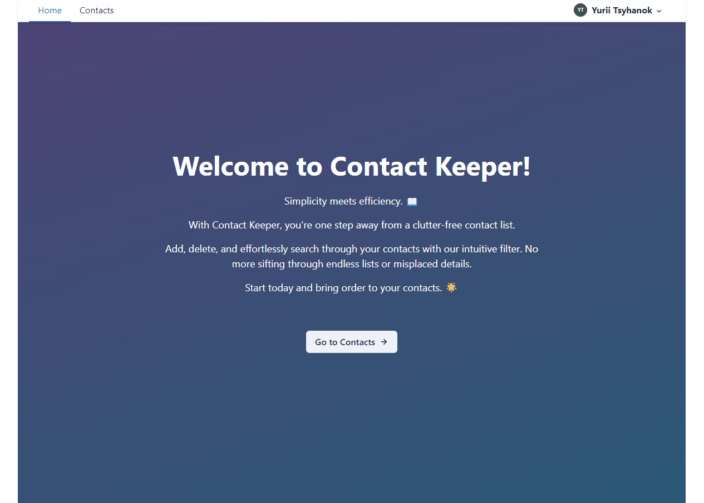

# Phonebook App

## Overview

The Phonebook App is a full-stack application that allows users to register, log
in, and manage their personal contacts. It features a clean and user-friendly
interface for easy management of contacts, including functionalities for adding,
editing, deleting, and filtering contacts.


## Features

- User Authentication (Register/Login)
- Contact Management (Add/Edit/Delete)
- Contact Filtering
- Responsive Design
- Real-time Updates

## Technologies Used

- **Frontend:**

  - React.js: Main framework for UI
  - Redux: For state management
  - Redux Persist: For persisting Redux state
  - React Router: For in-app navigation
  - Formik: For form handling
  - Chakra UI: For component styling
  - Framer Motion: For animations
  - Axios: For HTTP requests

- **Backend:**

  - Node.js: Server-side platform
  - Express.js: Framework for Node.js
  - MongoDB: Database
  - Backend Repository:
    [Contacts Manager API](https://github.com/yurii-corssa/contacts-manager-api)

- **Additional Tools:**
  - ESLint: For static code analysis
  - Prettier: For code formatting
  - Git: For version control
  - GitHub Actions: For CI/CD

## Getting Started

To get a local copy up and running, follow these simple steps.

### Prerequisites

- npm
  ```sh
  npm install npm@latest -g
  ```

### Installation

1. Clone the repo

   ```sh
   git clone https://github.com/yurii-corssa/goit-react-hw-08-phonebook.git
   ```

2. Install NPM packages

   ```sh
   npm install
   ```

3. Start the application
   ```sh
   npm start
   ```

## Usage

After logging in, users can manage their contacts. The application provides
functionalities to:

- Add a new contact
- Edit an existing contact
- Delete a contact
- Filter contacts
- View a list of all contacts



## Contact

Yurii Corssa - [yurii.corssa@gmail.com](yurii.corssa@gmail.com)

Project Link:
[https://github.com/yurii-corssa/goit-react-hw-08-phonebook](https://github.com/yurii-corssa/goit-react-hw-08-phonebook)
